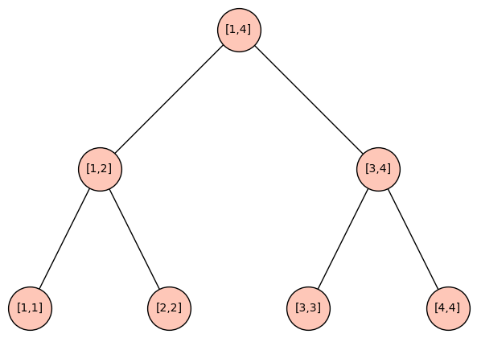

# 线段树

## 什么是线段树

线段树是一种树型数据结构，树中的每个节点代表一段$[L,R]$的区间，一个节点的左孩子和右孩子的区间不相交且其并恰好等于该节点对应的区间。树的叶子节点对应的区间为$[L,L]$，也即单点。

下图给出了一个对应区间为$[1,4]$的线段树示例。



::: spoiler 作图代码（SageMath）

```python
G = Graph({0: [1, 2], 1: [3, 4], 2: [5, 6]})
G.relabel({0: '[1,4]', 1: '[3,4]', 2: '[1,2]', 3: '[4,4]', 4: '[3,3]', 5: '[2,2]', 6: '[1,1]'})
P = G.plot(vertex_size=1500, layout='tree', tree_root='[1,4]', tree_orientation='down')
P.show()
```

:::

线段树常用于含修改的区间查询。比较裸的题目会直接包含若干种操作，其中一些为修改操作，另一些为查询操作。还有些题目，则需要通过一定的观察才能发现可以用线段树进行求解。

## 标记永久化

标记永久化指的是不下传懒标记，而是在每次查询时，逐层考虑懒标记中的信息。对于主席树、树套树等复杂数据结构，标记永久化有减小常数的作用，并能够一定程度上减少代码量。

## 练习题

### 模板题：[Codeforces Edu Segment Tree P1 S1B](https://codeforces.com/edu/course/2/lesson/4/1/practice/contest/273169/problem/B)

单点修改+区间查询。

::: spoiler 参考实现（Kotlin）

<<< @/docs/data-structure/segment-tree/src/CF-EDU-ST-P1-S1B.kt

:::

### 模板题：[洛谷P3372](https://www.luogu.com.cn/problem/P3372)

区间修改+区间查询。因为修改和查询都是区间操作，所以需要使用懒标记。

::: spoiler 参考实现：普通版本（C++）

<<< @/docs/data-structure/segment-tree/src/LG-P3372-Normal.cpp

:::

我们也可以引入标记永久化，虽然对这一题来说，性能上无法有明显提升，但代码量可以略微减少一些。

::: spoiler 参考实现：标记永久化版本（C++）

<<< @/docs/data-structure/segment-tree/src/LG-P3372-Persistent-Tag.cpp

:::

### [SPOJ: GSS1](https://www.spoj.com/problems/GSS1/)

本题只需要实现查询，不需要实现修改。关键是，我们需要存储哪些信息，才能够由子区间的最大值，得到父区间的最大值？

::: spoiler 提示一：节点需要存储的信息

- 最大和
- 最大前缀和
- 最大后缀和
- 总和

:::

---

::: spoiler 提示二：区间的合并

合并两个区间时：

- 总和可以直接由左右区间总和相加得到。
- 最大前缀可能来自左区间的最大前缀，或整个左区间加上右区间的最大前缀。
- 最大后缀可能来自右区间的最大后缀，或整个右区间加上左区间的最大后缀。
- 最大和可能是最大前缀，最大后缀，或左区间的最大后缀加上右区间的最大前缀，或左区间的最大和，或右区间的最大和。

:::

---

::: spoiler 参考实现（C++）

<<< @/docs/data-structure/segment-tree/src/SPOJ-GSS1.cpp

:::

<Utterances />
